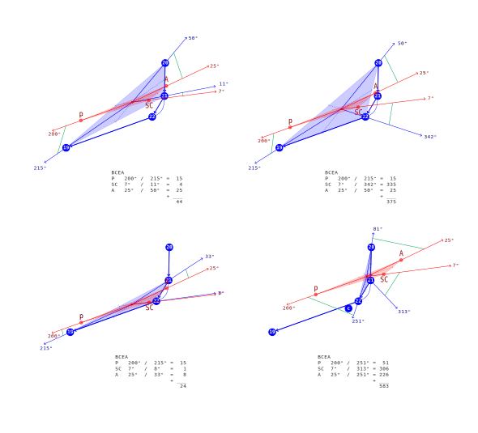

### **Contents**

1.  **Introduction**
    1.  **Profile**
    1.  **Project Overview**
        1.  **Background**
        1.  **Need**
        1.  **Scope**
        1.  **Activities**
    1.  **Organisational Documents**
    1.  **Phase Introduction**
        1.  **Phase Levels**
        1.  **Initiation Phase**
            1.  **Business Case**
                1.  **Solution Options**
                1.  **Strategic case**
                    1.  **Contributions**
                1.  **Management case**
                    1.  **Achievements Plan**
                    1.  **Timescales**
            1.  **Project Charter**
                1.  **Project Introduction**
                    1.  **Project Name**
                    1.  **Project Statements**
                    1.  **Project Definition**
                1.  **Project Goals**
                1.  **Project Structure**
                1.  **Deliverables**
                1.  **Duration**
        1.  **Planning Phase**
            1.  **Safe Planning**
                1.  **Project Plan**
                    1.  **Simplification Gradient**
                        1.  **Excessive Points Problem**
                        1.  **Method Implementation**
                            1.  **Simplification**
                            1.  **Graph Search**
                            1.  **Graph Matching**
                            1.  **Line Matching**
                            1.  **Naturalisation**
                1.  **Work Planning**
                    1.  **Task Assignments**
                    1.  **Dependencies**
                1.  **Schedule Planning**
            1.  **Stakeholders**
                1.  **Personnel Plan**
                1.  **Communication Plan**
            1.  **Quality Plan**
                1.  **Quality Targets**
                1.  **Quality Management**
        1.  **Implementation Phase**
            1. **Solutions**
                1. **BATRIC**


### Glossary

1.  **Glossary**

### Reference

1.  **Reference**


##  **Introduction**

We at **VivaRado** made this tool to help you with variable fonts!

---

### **Introduction / Profile**

*   Company: VivaRado LLP

---


### **Introduction / Project Overview**

*  Project Overview
    *  Background
    *  Need
    *  Scope
    *  Activities
    *  Important dates or deadlines

*   Project Name: Variomatic
*   Proposal Date: 2019/03/04, March fourth of 2019.

---

### **Introduction / Project Overview / Background**

Google Internationalization, abbreviated to the numeronyms i18n, includes Google Fonts that launched in 2010 to serve webfonts under open-source licenses, by 2016 is serving more than 800 webfont families.

In the context of making the web faster, on 14 September 2016, Adobe, Apple, Google, and Microsoft announced the technology of Variable Fonts, which allows a single font file to store a continuous range of design variants.

An approximation of size reduction, where a family of fonts is about 800kb, by serving a variable font that becomes 100kb, that is about 80% reduction. Let's just say that integrating the whole google fonts library of 800 families to variable format, will be as if google is just serving 100 families, the benefits to server loads and costs are not to be ignored.


---

### **Introduction / Project Overview / Need**

There is a need for an automated solution that will be able to "merge", or "make compatible", font instances that are otherwise incompatible.

> A program that, given 2 incompatible OTFs or TTFs, would make them into a VF with an axis between them.


---

### **Introduction / Project Overview / Scope**

Given the possible reduction the new format presents, we are tasked to create a concept or a working product that will be able to understand and resolve mainly cross instance contour interpolation. That will allow Google Fonts to Variate their whole font directory, subsequently reduce the server loads, increase font quality and designer collaboration.


---

### **Introduction / Project Overview / Activities**

Currently identified activities:

*  Present the first phase of documentation (this).
*  Create and present the Initiation and Planning for the project.
*  Identify the project tracks that will produce the deliverables.


---


### **Introduction / Organisational Documents**

The documentation for this project and the project modules has been split to partial MD files for easier editing and alterations. Three options are provided (HTML,PDF,MD) Contents of generated files are stored in the ``` /README ``` folder as numbered main files and includes in the ``` /README/partials ``` as partial MD files.

Documentation Types and generating them:

*  HTML - Responsive preview in HTML format - At README directory:

	```python3 README/gen_readme.py -f 'html' -l "L1"```

*  Standard Repository README - At the root of the repository:
	
	```python3 README/gen_readme.py -f 'md' -l "L1"```

*  PDF - At the root of the repository:
	
	```python3 README/gen_readme.py -f 'pdf' -l "L1"```

You can pass multiple formats:

```python3 README/gen_readme.py -f 'html,pdf,md' -l "L1"```

You can pass documentation Level:

Requirements:

*  Markdown2 module for python3
	
	*  Linux: ```pip3 install markdown2```
	*  Windows: ```py -m pip install markdown2```

*  pygments

	*  Linux: ```pip3 install pygments```
	*  Windows: ```py -m pip install pygments```

*  weasyprint

	*  Linux: ```pip3 install weasyprint```
	*  Windows: ```py -m pip install weasyprint```


Features:

*  Responsive Interface
*  Synchronized Sidebar
*  Hashtag Navigation
*  PDF with TOC and Cover

Drawbacks:

*  Graphs and Diagrams will not work in github and bitbucket preview, but are still readable.
*  Graphs and Diagrams will not work in PDF will be assessed.

Details:

*  For the PDF Contents. As we generate URL style blocks:
	*  We override the weasyprint Document.make_bookmark_tree

*  For the HTML and the Diagrams. As we load them into Codeblocks:
	*  We override the markdown2 ```Markdown._code_block_sub```
	*  We override the markdown2 ```Markdown._color_with_pygments```


---

### **Introduction / Phase Introduction**

**Initiation Phase**:

The reduction of the server loads is without a doubt the most important benefit. In broad definition to succeed in this task, we are required to create Variable fonts given the existing portfolio.

This document will serve as a reflection of this research being that it will constantly be updated to include the findings and the progress. That is in the hopes that progress will be made.

---

**Planning Phase**:

We as VivaRado will need to create an automated solution to variate incompatible fonts to the new variable font format, we are presenting a schedule and the suggested budget, the risks and stakeholders along with the quality expectations.

---

**Implementation Phase**:

The work begins by setting and maintaining the planned course, communicating the plan and changes, and monitoring the quality of the work and deliverables.

---

**Closure Phase**:

Releasing the final deliverables to the customer, closing documentation and updating organisational documents.

---


### **Introduction / Phase Introduction / Phase Levels**

#### Level 1:

And a **Project Charter** where the **Project Plan** / **Elements** will be later reflected. Can be thus omitted as is added during Level 1. For the selected **Solution Options**, we start the **Planning Phase** by expressing each of the options as a **Project Plan**. Each **Project Plan** is divided into **Elements**, then those are reflected to the **Work Planning**, **Resource Requirements** for each are identified, **Schedule Planning** and **Budget Planning** is created.

*  **Minimum Project Management Plan Level 1** Components ∞0.004:

    1.  **Profile**
    1.  **Organisational Documents**
    1.  **Project Overview**
        1.  **Background**
        1.  **Need**
        1.  **Scope**
        1.  **Activities**
    1.  **Phase Introduction**
        1.  **Phase Levels**
        1.  **Initiation Phase**
            1.  **Business Case**
                1.  **Solution Options**
                1.  **Strategic case**
                1.  **Management case**
            1.  **Project Charter**
                1.  **Project Introduction**
                    1.  **Project Statements**
                1.  **Project Goals**
                1.  **Project Structure**
                1.  **Deliverables**
                1.  **Duration**
        1.  **Planning Phase**
            1.  **Safe Planning**
                1.  **Work Planning**
                    1.  **Project Plan**
                        1.  **Task Assignments**
                        1.  **Dependencies**
                    1.  **Resource Requirements**
                        1.  **Scope of Requirements**
                        1.  **Production Strategy**
                1.  **Schedule Planning**
            1.  **Stakeholders**
                1.  **Personnel Plan**
                1.  **Communication Plan**
            1.  **Quality Plan**
                1.  **Quality Targets**
                1.  **Quality Management**


---

### **Introduction / Phase Introduction / Initiation Phase**

The important elements of the Intiation Phase for Level 1 is the **Business Case**, followed by a **Project Charter**.

**Business Case**:

What are the benefits we are trying to get from the project and justification of the decision. It encapsulates the research done to see if the project is worth doing.

---

**Project Charter**:

What are the deliverables and the authorisation to do the project. It encapsulates the announcement to do the project.

---


*  **Initiation Phase** Components ∞0.001:
	
	1.  **Business Case**:
		*  Strategic case
		*  Commercial case
		*  Management case

	1.  **Project Charter**:
		*  Project Introduction
		*  Project Goal(s)
		*  Project Structure
		*  Deliverables
		*  Duration


---

### **Introduction / Phase Introduction / Initiation Phase / Business Case**

A business case captures the reasoning for initiating the automated variation.

The purpose of a business case is to weigh up the costs and benefits of a suggested course of action and thereby present the argument for a new way of delivering variable fonts.

---

*  **Business Case** Components ∞0.003 Level 1:
    1.  **Strategic case**
    1.  **Management case**


---

### **Introduction / Phase Introduction / Initiation Phase / Business Case / Solution Options**

*  Currently identified Solution Options:

    *  Simplification Gradient (SGRAD)
    *  Bezier Contour Analysis (Future Implementation)
    *  Dynamic Point Repositioning (Future Implementation)


---

### **Introduction / Phase Introduction / Initiation Phase / Business Case / Strategic case**

Given the opportunities by the new format of variable fonts, Google has created tools like fontmake, that includes the varlib, in an attempt to merge compatible instances to variable fonts, effectively creating a paradigm. This enables Google Fonts to set the requirements for the next steps of managing the inconsistencies of those instances that are dubbed incompatible.

VivaRado has been tasked before in handling a case of manually updating an incompatible set of instances, to compatible variation capable instances that produced the new version of Advent font.

During that process VivaRado could identify the elements and conditions this could be possible effectively matching the strategic requirements of Google Fonts in delivering the new variable format, by minimising it's own footprint and server loads.


---

### **Introduction / Phase Introduction / Initiation Phase / Business Case / Strategic case / Contributions**


#### To Objectives:

Identified Objectives:
	
*  Create SGRAD
*  Integrate the solution to Varlib, FontMake

#### To Priorities:

The strategic priorities.

Identified Priorities:
	
1.  SGRAD for non-interpolatable GLIF Files
1.  Bezier Curvature Analysis
1.  Dynamic Point Repositioning


---

### **Introduction / Phase Introduction / Initiation Phase / Business Case / Management case**

The management case tests the feasibility of the preferred option, in terms of its deliverability within various tolerances.


#### Achievability:

Assessment of Achievability aspects of the project. Its primary purpose is to set out the project organisation and actions which will be undertaken to support the achievement of automatically creating compatible variable interpolation from incompatible contours.

*  Timescales
*  Available resources

---

### **Introduction / Phase Introduction / Initiation Phase / Business Case / Management case / Achievements Plan**

1.  **Milestones**
	1. Simplification Script according to Max Error
	1. SGrad
	1. SGrad Graph
1.  **Dependencies**
1.  **Key Roles**
1.  **Contingency Plans**
1.  **Major Risks**
1.  **Skillset Requirements**

---

### **Introduction / Phase Introduction / Initiation Phase / Business Case / Management case / Timescales**

The suggested contract to solve the Automatic Variation problem:

**April 1st 2019** to **December 20th 2019**

---


### **Introduction / Phase Introduction / Initiation Phase / Project Charter**


*  **Project Charter** Components ∞0.002:
	*  Project Introduction
	*  Project Goals
	*  Project Structure
	*  Business Solution
	*  Deliverables
	*  Duration
	*  Benefits and Limitations

---

### **Introduction / Phase Introduction / Initiation Phase / Project Charter / Project Introduction**

*  **Project Introduction** Components ∞0.002:

	*  Project Name
	*  Project Statements
		*  Vision Statement
		*  Mission Statement
	*  Project Definition
		*  Problem 
		*  Opportunity

---

### **Introduction / Phase Introduction / Initiation Phase / Project Charter / Project Introduction / Project Name**

*  Suggested Names:
	*  Variomatic or Vmatic


---

### **Introduction / Phase Introduction / Initiation Phase / Project Charter / Project Introduction / Project Statements**

####  Mission Statement:
    
Delivering an easy method to review and create variation compatible fonts!


---

### **Introduction / Phase Introduction / Initiation Phase / Project Charter / Project Introduction / Project Definition**

*  **Problem** Components ∞0.001:
	*  Making compatible variation instances requires tedious manual work.

*  **Opportunity** Components ∞0.001:
	*  Automatically Create compatible variation instances.
	*  Review incompatibilities.

---

### **Introduction / Phase Introduction / Initiation Phase / Project Charter / Project Goals**

Identified Goals:

*  Working on software to automatically take in a font family with a set of weights and put out a variable font with a weight axis. 
*  That software can depend on GlyphsApp or FontLab6 or RoboFont, although if it works only with fontTools that would be better, but increases the risk.
*  Create a interpolation layer that only cares about point numbers and contour direction.
*  Create a Plane that understands contour point warp or movement.
*  Recreate the contours according to the create layer.

---

### **Introduction / Phase Introduction / Initiation Phase / Project Charter / Project Structure**

*  **Project Structure** Components ∞0.001:
	*  Project Scope
	*  Project Team

---

#### Project Scope:

We have divided the project into the **Product Main** that is the **Variomatic**, and **Product Modules**. Each of those parts has its own set of development and design requirements. The project scope will be further updated during the LayerB.


#### Project Team:

The initial team that will provide the deliverables:

*  Andreas Kalpakidis
*  Madina Akhmatova

---

### **Introduction / Phase Introduction / Initiation Phase / Project Charter / Business Solution**


*  **Business Solution** Components ∞0.001:
	*  Approach Options
	*  Possible Technical Solutions

---

### **Introduction / Phase Introduction / Initiation Phase / Project Charter / Deliverables**

This in overview of the deliverables that comprise the proposed solution to the problem of automatically interpolating contours and creating variation capable font instances.

#### Deliverable Overview:

We want to create initially a command line tool that will be able to get a set of fonts, may that be UFOs, create a compound path similarity index by gradually simplifying the contour, then use this Similarity Gradient or SGrad and update, remove, cleanup the original compound contour according to the most needed points identified, without losing curve precision.

We can start by providing .GLIF files directly to the SGRAD script and build the necessary component alphas, then proceed to integrating it to a library, and maybe move in accordance to the structure of VarLib so integration to it could be easier.

This will then allow us to successfully run the fontmake commands and receive the final interpolated variable font.

We want to create an interface, natively in the browser that will allow the user to review the script findings and accept alterations.

#### Deliverable Specification:

Further discussion and updates will be added to this section, that are related to the specifics of functions and features of the deliverables.

---

### **Introduction / Phase Introduction / Initiation Phase / Project Charter / Duration**

*  **Duration** Components ∞0.001:
	*  Timeframe
	*  Milestones

The Timeframe of this project has been set and the Milestones, will be elaborated on in further detail, they are a subject of constant update and will change before we progress further into the Planning Phase.

#### Timeframe:

This project will take place between **April 1st 2019** and until the end of **December 20th 2019**.
The duration is ≃10 months. There is a possibility not to be excluded that a further time frame will be required for a possible implementation of the program to the Google Fonts portfolio, or in case of possible unforeseen risks.

#### Milestones:

**Currently Identified Milestones** Components ∞0.001:

*  Create initial demos and tests for the solution of the given problem of automatic interpolation.
*  Functionality that understands the important contour points and maintains them while removing the excess ones.
*  Links the points that are related across instances
*  Use the similarity gradient points as a guide for original point cleanup.
*  Optimize the font compatible spline system equally across the instances.

---

### **Introduction / Phase Introduction / Initiation Phase / Project Charter / Benefits and Limitations**

Benefits:

*  SGRAD Straight contour matching allows for a relatively good match solving multiple stray points.
*  Reviewing the output SVGs allows for better understanding of what areas of a contour are problematic

Limitations:

*  SGRAD cannot always provide 100% results when the contours have major issues.

* the contour sorting fails for non line travel distance sortable, as it tries to calculate the travel distance, of each contour and sort. 	For example the inner part of the letter "O" from the outer, is a smaller travel distance in both instances. Where this is not true for glyphs like "=". A approximate position or centroid or barycentric of the contour points, in the glyphs will probably have to be taken into account.

* If end start is in the uncertain lines, final green matching line doesn't visually close.

* If triangle matching and inline check fails for uncertain lines... well there is no matching.
	
* At the moment there is no final line in a usable list, it is though plotted as green for certain and lime for uncertain basic_cleanup and match_uncertain_tris.
	
* This script doesn't do curved bezier contour analysis, it does straight point position comparison across simplification levels. In further iterations we will improve to do bezier contour comparison.

* As it doesn't do curved bezier contour analysis, there is a very small chance the certainty matching gives incorrect matching. But if this happens, there is a chance there are move issues than just that and those issues will be directly visible.

* Adding curved bezier contour analysis will result in 100% matching and cleanup. In respectfully similar contours. Do not expect this to work with two random letters, there is no morphing.

* The script solves only two instances against each other, there is no multiple instance support at this moment.

* The code needs a strong cleanup.

* Networkx should be removed.

---


### **Introduction / Phase Introduction / Planning Phase**

The Planning Phase, is where the project solution is further developed in as much detail as possible and the steps necessary to meet the project’s objectives.

The Planning Phase consists of:

1.  **Safe Planning**
1.  **Stakeholders**
1.  **Quality Plan (PQP)**


At this point, the project would have been planned in detail and is ready to be executed.

---

### **Introduction / Phase Introduction / Planning Phase / Safe Planning**

The project's **Project Plan** is created outlining the activities, tasks, dependencies, and timeframes. 


*  **Safe Planning** Components (Scope Management): 

	*  Project Plan:
		*  Activities
		*  Tasks
		*  Timeframes
	*  Work Planning:
		*  Dependencies
	*  Schedule Planning.

---

### **Introduction / Phase Introduction / Planning Phase / Safe Planning / Project Plan**


During our initial research we have identified one possible solution that if implemented will successfully produce the required interpolation capable contours. More solutions would be researched.

*  Current Plans in Development:

	*  Simplification Gradient (SGRAD)

*  Future Plans:

	*  Bezier Curve Analysis
	*  Dynamic Point Repositioning

---

### **Introduction / Phase Introduction / Planning Phase / Safe Planning / Project Plan / Simplification Gradient / Excessive Points Problem**

#### Provided Instances

We are given two instances, one is a Regular and the other is a Bold.
From those for the sake of this example we use a Compound Section.


image: #001, 0.001, svg, compound section of "&" for regular and bold instances.

#### Enumerated Matching

Enumeration over the point array fails, as there are excessive points and the matching proceeds inconsistently. This results to a failed match and a failed font variation.


image: #002, 0.001, svg, enumerated matching between given instance compound sections.

---

### **Introduction / Phase Introduction / Planning Phase / Safe Planning / Project Plan / Simplification Gradient / Method Implementation**

We present an example of implementing the Simplification Gradient (SGRAD) method over a compound section of a complete glyph.

---

### **Introduction / Phase Introduction / Planning Phase / Safe Planning / Project Plan / Simplification Gradient / Method Implementation / Simplification**


#### Simplification Gradient on Instance, value Max Error

We produce a simplification for each compound, iterating the Max Error by 10%.


image: #003, 0.001, svg, Simplification Gradient - Simplification Gradient.

---

#### Point Importance Index. Survival across simplification gradient

This method due to the results, works on geometric forms, and even then it performs poorly. There is heavy reliance on a simplification algorithm that "prefers" straight lines.
And a possible need of a Curve Fitting algorythm. Tests have been made on rasterizing, then vectorizing and simplifying, a method that might be used to counter very dirty contours that cannot be matched.

Points that we dont need tend to remain longer during simplification. This gives them higher score compared to points that we really need to remain.


**SCHEDULE:** ```VRM-1001```


---

#### Product

Here we can see the SGRAD with the evaluated points from the Simplification Gradient, and how they overlay the original provided compound. Allowing points that are at a minimum of 40% threshold, we can see that there is a matching candidate we can use as a guide. The simplification iteration could be even more granular.


image: #006, 0.001, svg, Simplification Gradient - Evaluated Overlay SGRAD and Original.

---


image: #007, 0.001, svg, Simplification Gradient - Cross instance SGRAD Matching.

---

### **Introduction / Phase Introduction / Planning Phase / Safe Planning / Project Plan / Simplification Gradient / Method Implementation / Graph Search**

We are creating a positioned graph. Then we can compare the instance graphs since we can create a center node and then see what points are the relatives, judging by the edge and not only by the coordinate similarity. That means that the letters between instance could virtually be located at different coordinates, but still have the same, similar shape, we could still locate them. Since we are evaluating according to graph center.


image: #010, 0.001, svg, Simplification Gradient - SGrad Graph Comparison.

This logic so far has been proven to work in tests. The logic behind this approach, without the need of SGrad.

**Graph Zoom Search**:

*  Parse points across two GLIF instances.
*  Create a topological graph.
*  Get center of all coordinates for each instance.
*  Align instances based on that center.
*  Create a sorted dictionary with the most distant to the closest, from the center points.
*  Perform Radius Search for each point, to find the closest point that belongs in the opposite instance.

This method works without simplification (^1). Working from the outside towards the inside. We have seen that even complex letters result in a proper match.
This method fails if implemented from the inside towards the outside. So sorting according to most distant to the center is important.
The graph logic so far proves to be appropriate for the solution of the autovariation.


^1: Although RAVS (rasterize-vectorize-simplify) could work if there would be later on comparison of the RAVS instances with the original ones and evaluation of what points we keep and remove.


---

#### Finding the Unmatched Points:

In the image #011, we can see in the produced result of Graph Zoom Search, that there are two points that do not correspond to each instance, marked in red. Those points will be dealt with in Naturalization. But let's see how we got this result.


image: #011, 0.001, svg, Simplification Gradient - Graph Zoom Search - Unmatched Points.

---

#### Radius Match on Graph Zoom Search:

In the image #012, we can see in the Radius Search looking for nearby points from the opposite instance.


image: #012, 0.001, svg, Simplification Gradient - Radius Match.

---

#### The whole picture:


image: #013, 0.001, svg, Simplification Gradient - Graph Zoom Search and Radius Match


---

#### Graph Zoom Search:

In the demo function we have maintained the functionality of simplification as it might later on be required. The given method does not require simplification by what we have seen so far. We can see that the nodes have been sorted according to the distance from the center. Now we will move forward to producing the Radius Match functionality.

We identified a labeling bug in image #014. Where the old version was labeling incorectly. We can see that in comparison to image #015 where the labeling is according to length.

---

#### Single Search

Demo Function Here: ```python3 lib/graph_search/demo_graph_search.py```


image: #014, 0.001, svg, Simplification Gradient - Graph Search actual script product.

Here we can see the Radius Match finding the demo green point, any point above a specific Max Radius is not considered a match.
This will be extended to search points in between instances, by removing matched points from the agreed match array.


image: #015, 0.001, svg, Simplification Gradient - Graph Search and Radius Match actual script product.

---

#### Multiple Search

Demo Function Here: ```python3 lib/graph_search/demo_graph_search_multi.py```

Here we can see RadiusMatch finding the points that match between instances. It has no memory of best match that is why it might match the same points. If it had memory it would know the best matches for each point have been met, depending on distance, and so there would be no matching errors. Other than that the matching is successful, the next step is to implement memory.

*  Identified Memory Logic Rules:

	*  If a point from instance A has been matched with a point from instance B, which has a match with a closer point of instance A, prefer the closer distance point. 
		*  Avoids points that exist in one but not the other instance.

	*  If a point has been matched but is out of serial order or line (2,6,4), prefer the point that is in serial order or line (2,3,4). 
		*  Avoids points to be matched, that even though are in close proximity are not on the same line.
		*  Avoids points that exist in one but not the other instance.

	*  There are things we could do with simplification aswell but we have not yet identified issues that lead us to use additional matching rules.


image: #016, 0.001, svg, Simplification Gradient - Graph Search and Radius Match actual script product matching best candidate between regular and light.

[Variomatic TopoGraph RadiusMatch](https://www.youtube.com/watch?v=UWCHRD1Fp2k&feature=youtu.be)

video: #001, 0.001, youtube, Simplification Gradient - Graph Search and Radius Match - screencap.

---

#### Ignore Better Matched

Demo Function Here: ```python3 lib/graph_search/demo_graph_search_multi.py```

Here we can see Radius match with one rule added. The rule iterates each instance to instance agreed list, see if match exists in the other instances agreed list and compares the distance, if the distance in the other instances agreed is smaller, it adds that point to ignore. That makes the search leave the smallest distance, and ignore remove the other. We can also see that the points that do not exist in the other instance have no match. Making them removal candidates. Since the removal candidates are now defined and found, we can proceed with the removal and heal of the curves. We noticed that the circles created during the search, where centered on the found node whereas they should be on the node that initiates the search, like a cartoon sonar... During the integration we found that there was a problem with simplification not being drawn, that is now fixed.


image: #017, 0.001, svg, Simplification Gradient - Graph Search and Radius Match actual script product matching best candidate between regular and light, and ignoring points that do not exist.

[Variomatic TopoGraph RadiusMatch with Ignore Rule](https://youtu.be/L_xM--f-Lj0)

video: #002, 0.001, youtube, Simplification Gradient - Graph Search and Radius Match - Point Ignore Rule - screencap.


**SCHEDULE:** ```VRM-1003, VRM-1004```


---

### **Introduction / Phase Introduction / Planning Phase / Safe Planning / Project Plan / Simplification Gradient / Method Implementation / Graph Matching**

#### Tests and emerging requirements

During testing we identified a set of additional requirements:

*  The more similarly positioned the instances compared, by applying scale or move, the better the matching.
*  Simplification and the SGrad will probably be used, as selection of the wrong - easily disgarded paths, by simplification - leads to eroneus matching.
*  Matching should probably begin at a high simplification level, and gradually add detail, by reducing simplification, while evaluating path matching according to persistance of paths, in addition to cross instance, better-closer distance match.
*  There is a concept of segmentation of paths. Then comparison of matches to the position.

#### Example of shape similarity before match

An example of garamond where we can see the matching difference when some transforms are applied to the shapes before matching. The Radius Search being agnostic in terms of graph cluster comparison, results in wrong matching. But the best results come from just centering the differences of the total coordinate extent, the coordinate centers in both axes.


image: #018, 0.001, svg, Matching Garamond with shape transforms.

#### Cluster Matching

What the Radius Match is good at finding the clusters, or regions. Even if the point by point results sometimes is matching incorectly, there is a visible similarity in the clusters found for each point. There is also a preset function for rule checking and ignoring paths based on some criteria. The criteria we have tested before is distance based, per point.

Now we will need to go deeper than the ```letter / contour```. We will have to do radius matching on ```letter / contour / region```. Let's see then how we can obtain the clusters or regions. Here we have radius match for Blue instance point 0, that returns a cluster for instance Red. Then we can ask for points from Blue that are in the circle of the most distant match. This provides us with the clusters we need to start our comparison.


image: #019, 0.001, svg, Obtaining the clusters.

---


image: #020, 0.001, svg, Red and Blue Clusters for point 0.

---

#### Cluster Direction


image: #021, 0.001, svg, Determine Cluster Direction and Start Point.

---

Here we are running a direction finding function:

A reminder here that the numbers of the nodes are based on the distance from the center.

*  split everything before the search center.
*  split the list where there is a smaller number following a larger one.

```
If we are matching for point 0 and the obtained cluster would be:

[3,0,1,2,5,12,11]

The first split would result to:

[0,1,2,5,12,11]

The second split would result to:

[0,1,2,5,12]

Providing us with a list that every value after each value is larger.

```

---

#### Cluster Matching

After we overlay the coordinates on the search centers, we can run the same functions Radius Match Search (RMS) with Ignore Better Matched Rule(RIBM), and this will provide us with the correct matches. Onward to integrating this.


image: #022, 0.001, svg, Cluster center to Start Point and Radius Match with Ignore Better Matched.

---

Here we have the lines being drawn, now we will have to match them (probably by edge angle), then overlay them on the same coordinates, and then run radius match.

Demo Function Here: ```python3 lib/graph_search/demo_graph_search_lines.py```


image: #023, 0.001, svg, Lines created for graph matching.


image: #024, 0.001, svg, closeup of the lines.

---

Relevant Algorithms:

*  Locality-sensitive hashing
*  Map Matching
*  Fréchet distance
*  Dynamic time warping


**SCHEDULE:** ```VRM-1005, VRM-1006```


---

### **Introduction / Phase Introduction / Planning Phase / Safe Planning / Project Plan / Simplification Gradient / Method Implementation / Line Matching**


#### Line Matching Pre and Ante

From the points that create the line, we designate two observers, before and after the Search Center (SC). One point is pre-SC and the other point is ante-SC. When both observers of the Search Center (SC) verify the same point then have a true Match. From the matching scenarios that are incorrect. We have deducted a methond to fix the matching by using the Ante-Pre method.


image: #025, 0.001, svg, Pre Ante Rule diagram.

Here are some images from the breakdown of the rule on some cases non the less..


image: #026, 0.001, svg, Pre Ante Rule example case diagram.

---


image: #027, 0.001, svg, Pre Ante Rule example case diagram.

---


image: #028, 0.001, svg, Pre Ante Rule example case diagram.

---

#### Line Matching Degree and Distance Based

The point match is the one that is closest and has the less degree diff between the edge to the current search node and itself. This method was not effective.


image: #029, 0.001, svg, Degree and Distance based matching

---


image: #030, 0.001, svg, Degree and Distance example case diagram.

---

#### Line Matching Center Transfer Method

After overview of quite a few methods we have finally founda candidate that is in our opinion the most appropriate. Testing the Center Transfer method proves to work over the scenarios that previous methods failed.

Center Transfer Method Logic:

*  Each instance has a center, both of the centers are at the same coordinates.
*  For the point that we are running as Search Center (SC).
	*  For the point that we are running as Search Center (SC). 
		*  Take a line that connects to the center of the instance.
		*  At the point where that line meets the Search Center, create a perpendicular at 90deg to that line (Center Transfer, dashed line)
        *  Locate points from the target instance that are close to the Center Transfer (dashed line) by adding 90deg lines extending to them.
        *  Calculate the distance of those and prefer the smallest distance in terms of drive on the CT line (x axis) and drive on the perpendicular of the CT (y axis) that meets the target point.

---


image: #031, 0.001, svg, Center Transfer method running for both instances.

---

From the matching results we can see that the previously mismatched points:

*  Red 11 now matches Blue 12
*  Blue 4 now doesn't match any of the red points as Blue 7 and Blue 2 have better matches.

Demo Function Here: ```python3 lib/graph_search/demo_graph_search_center_transfer.py```

---

#### Line Matching Center Transfer Surface Method

We now calculate the surface of the center transfer point and we match all the points successfully BUT 9... Trying to see why that one fails.


Demo Function Here: ```python3 lib/graph_search/demo_graph_search_center_transfer_surface.py```


**SCHEDULE:** ```VRM-1007-0001```


---

#### PSCA (Pre, Search Center, Ante) Brokerage

```
Target PSCA Match Product 

PRE MATCHES:
[[(8, 15),
 [(13, 20),
 [(20, 21)]
]

SC MATCHES:
[[(15, 19),
 [(16, 18),
 [(9, 16)]
]

ANTE MATCHES:
[[(9, 16),
 [(10, 17),
 [(16, 18)]
]

```

We are now tasked with identifying the procedures that will broker the points across the observers (Pre and Ante). One of the methods we will most likely use is to look for series to identify firstly if the source instance Search Center exists at all in the target instance.

If we take a look at the code above we can see lists that refer to the Pre point, that is the point before the given Search Center (the point we are looking to match), and the Ante is the point after the SC. Each match has a tuple with two numbers in it. The first number represents the index based on the distance from the center - graph edge length, and the second number represents the index on the line, of that anchor.

For each of those lists we have 3 matches, this specific piece of matching result is when we are trying to match a point that doesn't exist in the target instance.
By this example we can see that any point in Pre doesn't have a sequence that increments by one point, through the SC until it reaches the Ante, we can see though that Pre(8,15) and Ante(9,16), have an increment of 1, that is proof that the SC doesn't exist at all as a match in the Target Instance.

Expanding on the logic on how to broker those points will provide a solution on matching with precision.

Further on we will use the points in the Match Product to create triangles that we can compare against the Source PSCA triangle and determine what triangle is the best fit for out current SC.

---

#### PSCA Triangle Comparison Barymetric Center Extension Angle




image: #033, 0.001, svg, Barymetric Center Extension Angle comparisson against triangles


We construct the matching triangles and find the barymetric center, we move the source triangle over the target triangle based on the barymetric centers, then we compare the angles in radians, of the source and target triangle lines, by extending from the barymetric center towards the nodes and comparing SC lines.

We can see that all the points match, and points that don't exist in the target the match returns nothing (red circle).

The more functions we use to compare the triangles the better. In case we see that some results are failing we can devise more triangle comparison functions.


Demo Function Here: ```python3 lib/graph_search/demo_gscts_psca_tcbcea_a.py```

[YouTube Video Here](https://youtu.be/X_bwzci6Ktg)

---

#### SGRAD Travel Distance Comparisson.

There are occasions where we get a line that is not correct, for that we implement travel distance comparisson.

We pass the results of the Center Transfer, that carries matches for each of the PSCA points. Then for every of the three matches contained in those three CT items (P, SC, A), we run a get distance from trace.

For each of those points inside each of PSCA we ger a coordinate range of two steps forward and two steps backward for P and A. And for those points we get the most occuring matches according to SGRAD. Then we trace the travel distance for each of those points (get_coord_range_finder).

We calculate if the point we are traveling is forward in glyph index or backward and assign a penalty if the traveling is going against the stream. On each direction as Pre points are supposed to travel counter clockwise and Ante points Clockwise.

We then evaluate the record and resort the CT results according to that.
This has been found to have a corrective results to lines and later produce better items for the triangle matching.

---

#### Results

After we have run each instance against each other. We have two SGRAD results. We can now use a combiner function to attempt and make the final combinations.

Here we show some of the results that we have gathered. Keep in mind that these pictures are without a combiner function and what we do is get the largest contour , not all the contours, run the variomatic and get the SGRADs that we then connect each points to each other according to SGRAD. Blue letter extends a blue line to the red letter and vice versa. There is also a thinner straight line connecting each point, this is the simlification line.

We can see that when there is a equilibrium in point count, the script returns appropriately matched letters where each SGRAD point looks at the appropriate point on the other instance. Just as you would have if the points where starting from the same location and just iterate each, combining with each, while what we do is completely different we get the same result.

We can also see that when the points are excess or misplaced, there are attempts of connecting to other points across the glyph points.

Because there is a rating for each of those points according to how many times they attempt a connection with the other instance, we can have useful data for the evaluation that we will need in the final combiner function.

I want to stress once more, that there is no attempt to remove or add points at the moment, all the images bellow are from the same run of the script on Garamond Pro Bold and Regular. The lines created are from each SGRAD and the thickness and radius of point circles corresponds to the value of attempts to connect with those points.

We could then get the uncertain areas between high certainty areas, and run an initial triangle matching.
From the points we gather we can then run triangle matching further on points we didn't match, with spamming triangles in intermediate points. We gradually gather the points we need and comprise a line.

---

Review the whole set of initial data at the repository here: 


```lib/batric/output_data/a/```


---

### **Introduction / Phase Introduction / Planning Phase / Safe Planning / Project Plan / Simplification Gradient / Method Implementation / Naturalisation**


#### Instance Original Point Naturalisation

Not implemented yet, but it will be based on remove and heal using fontparts after all the matching rules and quality checks run. Either Keep only overlapping points between the original instances and SGRAD. Or proceed to further Enhancing additional points to the final product. The curve difference must be in accordance to the Curve Difference Quality Target.


image: #008, 0.001, svg, Simplification Gradient - Cross instance SGRAD Matching.

---


image: #009, 0.001, svg, Simplification Gradient - Just SGRAD-abduct points from original instances.

---

#### Conclusion

SGRAD if not the easiest method is definitely a promising one. Given that the Max Error can be adjusted to be more granular, this only gives a more precise measurement for what are the points that keep persisting across. Those points are the most important ones and the ones we eventually keep for the final variable interpolation. We think that it provides good enough certainty by using straight no curve lines, and then we can step in and do bezier curve analysis, maybe with dynamic re-positioning.

---

### **Introduction / Phase Introduction / Planning Phase / Safe Planning / Work Planning / Task Assignments**

We have identified a possible solution, and we are waiting for plan approval by Stakeholders.

---

### **Introduction / Phase Introduction / Planning Phase / Safe Planning / Work Planning / Dependencies**

*  SGRAD Components ∞0.001:
	*  Simplification Gradient:
		*  Path, Contour Simplification.
			*  According to Threshold Angle.
		*  Combiner
	*  SGradient to Instance:
		*  Method to transfer the SGradient Guide to the final compounds of each glyph.
			*  Point Match according to coordinates.
			*  Method to maintain curve when points are removed.
	*  Network X (To be removed)
	*  Plotlib


---


### **Introduction / Phase Introduction / Planning Phase / Safe Planning / Schedule Planning**

Overview:

**2019-10-29 / Publishing initial Variomatic (BATRIC) on GitHub**


Schedule:

*  Current:
    *  **Planing and Scheduling** / After P.O.:
        *  **VRM-1000** Point Importance Plan Scheduling / Andreas Kalpakidis & Madina Akhmatova
            *  **VRM-1006** Implementing Regional Radius Match (RRM).

*  Completed:
    *  ~~**Assumptions Research** / 2019-March-07 until the end of 2019-March-21~~:
        *  During the assumptions research we have identified a possible solution, the Point Importance Product.
    *  ~~**Docs LayerA Update** / 2019-March-22~~:
        *  We have updated the documentation to match that of our initial findings a little early - at March 16
    *  ~~**Plan Approval by Stakeholders** / 2019-March-17~~:
        *  Plan has been approved and a total has been accepted.
    *  ~~**Doc Update to 0.007** / 2019-March-18~~:
        *  The documentation has been updated to reflect current status.
    *   **VRM-1001**:
        *  ~~One simplification solution implemented. ```demo_simplify.py``` 04/02/2019 5h~~
        *  ~~SGrad and SGrad Graph (topo). 04/03/2019 7h~~
    *   **VRM-1004**:
        *  ~~Radius Match, with demo point match. 2019-04-09, 4h~~
        *  ~~Radius Match Multi, with demo point match. 2019-04-14, 8h~~
        *  ~~Radius Match Multi, with ignore rule. 2019-04-17, 8h~~
    *   **VRM-1005**:
        *  ~~PIP Testing different contours. 2019-04-20, 4h~~
    *   **VRM-1006**:
        *  ~~Demo of Region Radius Match. 2019-04-26, 8h~~
    *   **VRM-1007**:
        *  ~~VRM-1007-0001 Schematics and Explanation~~

Task Codes:

*  VRM-1001 Simplification
*  VRM-1002 SGrad
*  VRM-1003 Graph Zoom Search
*  VRM-1004 Radius Match
*  VRM-1005 PIP Testing
*  VRM-1006 Regional Radius Match
*  VRM-1007 Line Matching and Point Validation
*  VRM-1008 Line Matching Center Transfer
    *  VRM-1008-0001 Surface
*  VRM-1009 Barymetric Triangle Matching by Extension angle
*  VRM-1010 BATRIC
*  VRM-1010-0001 Line Aggregate - Perfect Line
*  VRM-1010 BATRIC
    *  VRM-1010-0001 BATRIC Line Aggregate
    *  VRM-1010-0002 BATRIC SGRAD
    *  VRM-1010-0003 BATRIC Complete Font Matcher
    *  VRM-1010-0004 BATRIC Combiner
*  VRM-1011 BATRIC Documentation Update


---

### **Introduction / Phase Introduction / Planning Phase / Stakeholders**

We identify the **Stakeholders** by a **Personnel Plan** and create a **Communication Plan** to keep the **Stakeholders** informed.


*  **Stakeholders** Components:

	*  Applicable Stakeholders (Conscious and Unconscious Entities):
		*  clients
		*  personnel
		*  funders
		*  suppliers
		*  equipment
	*  Groups
		*  Development Group
		*  Organisation Documents Group
		*  Testing Team (TeT)
	*  Personnel Plan
	*  Communication Plan
		*  Stakeholder Feedback Mechanisms
		*  Required notifications

---

### **Introduction / Phase Introduction / Planning Phase / Stakeholders / Personnel Plan**

*  **Personnel Plan** Components ∞0.001:
	*  Organizational Structure
		*  team members
			*  internal
				*  Andreas Kalpakidis
				*  Madina Akhmatova
			*  external
				*  Dave Crossland
	*  Responsibilities and Qualifications
		*  Project Management and Accounting: Madina Akhmatova
		*  Planning and Design: Andreas Kalpakidis
		*  Review and Acceptance: Dave Crossland


---

### **Introduction / Phase Introduction / Planning Phase / Stakeholders / Communication Plan**

*  **Communication Plan** Components:
	*  Stakeholder Feedback Mechanisms
	*  Required notifications

#### Stakeholder Feedback Mechanisms

Currently the Stakeholders are notified by the README.md and README.html and README.pdf. Stakeholders can be notified by mail or in a forum to be presented soon. Github is also a viable method.

---

### **Introduction / Phase Introduction / Planning Phase / Quality Plan**

A **Quality Plan** describes the activities, standards, tools and processes necessary to achieve quality in the delivery of a project.

We can now create a **Quality Plan** by identifying the valid **Quality Targets** we want to achieve. Identify the **Quality Policies** that will be required to achieve them. Identify how to do **Quality Measurement**. Lastly identify how to maintain quality with **Quality Management**.


*  **Quality Plan (PQP)** Components:
	
	1.  Quality Targets
		*  Curve Difference.
	1.  Quality Measurement
		*  Combiner and Cross Matching.
	1.  Quality Management

---

### **Introduction / Phase Introduction / Planning Phase / Quality Plan / Quality Targets**

**Quality Targets** we want to achieve and what are their **Acceptance Criteria**, **Testing Parameters** and **Quality Management Procedures**, for each **Applicable Category**

1.  Quality Targets Components:
	*  Acceptance criteria
		*  Identify an acceptable curve difference threshold.
	*  Testing parameters
		*  Applicable Stakeholders
	*  Quality Management procedures
		*  Identify a Curve Precision Difference Calculation procedure.

---

### **Introduction / Phase Introduction / Planning Phase / Quality Plan / Quality Measurement**

Identify how to do **Quality Measurement** to see if we meet **Performance Standards** and **Acceptance criteria** and how those get collected by our **Performance Documentation Method**.

1.  Quality Measurement
	*  Performance Standards
		*  Performance Documentation Method

After each instance runs for each level of the simplification seed, creating the SGRAD, we pass the data to the combiner function, we gather point to point cross matching and measure how many times points match each other. This allows for us to understand the quality of matching. Points that do not have cross matching will be lower in quality. While creating the SVG we assign a larger radius to the points that have cross matched more times.

More on this subject and specifics will be presented here in the nearby future. For the moment after we run the function we end up with matching quality levels.

Currently we have 3 quality levels based on uncertainty:
	
* Low Uncertainty 
* Mid Uncertainty 
* High Uncertainty 

---


### **Introduction / Phase Introduction / Planning Phase / Quality Plan / Quality Management**

**Quality Management**, the nature of the **Audits**, **Work Verification** by assigning responsible personnel for **Task Fulfillment** and **Task Checking**.

1.  Quality Management
	*  Audits
	*  Tool Scheduling
	*  Work Verification
		*  Task fulfillment responsible personnel
		*  Task checking responsible personnel


---

### **Introduction / Phase Introduction / Implementation Phase**

---

### **Introduction / Phase Introduction / Implementation Phase / Solutions**

*  Researched Solutions:

	*  BATRIC
		*  Graph Search Outside-In - Center Transfer - Line Matching - Barycentric Triangle Comparisson


---

### **Introduction / Phase Introduction / Implementation Phase / Solutions / BATRIC**

Needs review of current code structure and update (VRM-1011 BATRIC Documentation Update).

Location: ```lib/batric```


1.  **BATRIC Execution Sequence** Components ∞0.001 to be updated:
	1.  Initiator ```init_instances```:
		1.  Initiator Maker ```make_instances```:
			1.  Simplification Display ```fitCurve```
			1.  Main Function ```do_rad_search ```:
				1.  Point Matcher Source ```get_source_matches ```:
					1.  Get Encircled ```in_circle```
					1.  Get Circular Line Index ```get_line_inx```
					1.  Get Encircled PSCA ```get_points_around```
					1.  Rotate Points ```rotate_points```
					1.  Get Point Line ```get_point_line```
					1.  Plot Point Line ```plot_region_line```
					1.  Line Check ```do_line_check```
						1.  Create Center Transfer ```make_ct```
						1.  Get Barycentric ```barycentric```
						1.  Compare Triangles ```triangle_comparisson```
							1.  Get Target Match PSCA ```evaluate_psca```
							1.  Move Triangle Coordinates ```move_tri```
				1.  Point Matcher Target ```get_target_matches ```:


**Initiator Maker**:

We initiate the instances by providing .glif format strings with 2D vector data. Our instances are divided into Source and Target instances, the Source is considered "gnostic" and the Target "agnostic", because in the Source, having a current_point, we can define our PSCA (Pre, Search Center and Ante points), making it gnostic, in contrast for Target we cannot define those points unless we proceed with creating a line with points matched by the PSCA, making Target agnostic.

**Main Function**:

When we have the initiated graphs for each instance (Source and Target), we can obtain a lengthwise list based on the graph center to node - edge length. As we essentially overlap the instances based on the graph center, the barycentric of the graph. This way we avoid iterating points based on their index in the shape as the vectors may have differentiation in point indexing.

We find the immediate points before and after the SC (Search Center), that is the point that we are currently iterating or the most distant point from the center (Outside to Inside). We manage to have a sPSCA for the gnostic or Source side, keeping in mind the circular nature of the sPSCA as it may overlap the line start/end.

Then we attempt to gather the agnostic side points that are at a specific radius from the sPSCA (Source PSCA). If there is nothing found in that radius we assume a "ghost point" and provide the coordinates of the P or A (Pre or Ante) points as matches as we rely on a minimum number of three points so we can identify matches.

We then plot the line on the Source making sure of the appropriate circular indexing where lines should not jump across the shape, and should actually be positioned exactly on the existing lines of the glif vectors.

Proceeding to the creation of the center transfer method that looks for Target points close to the sPSCA line and Source points - according to a perpendicular to the graph center and each sPSCA point, extended infinitely line - by further creating lines from those found target points found inside a radius of the sPSCA points, and sorting based on a created triangle that includes as points ( one: the current sPSCA point, two: the target point that we matched, three: the intersection of the infinite perpendicular line and the line extended from the target matched point), calculate that triangles surface area and we have best Target matches for each of the Source P, SC and Ante points.

Moving on to triangle comparison, we can now create the barycentric of the sPSCA (sPSCA_bar), evaluate the tPSCA triangles according to our rules, and start comparing and matching them to our sPSCA by overlapping them according to barycentric and comparing angles differences, edge lengths surface areas to obtain the best matching.

**Aggregate Line**:

We now know if P, SC or A is incorrect and create a new line by combining the other lines. This means that if by increasing radius to gather agnostic points in the target that do not properly create a line, we correct this by always getting 7 points, 3 points from each side of the most favorite to the SC, we do this by using our P and A points as observers, we also know if any of the P SC or A do not exist, we will use this to filter out a perfect agnostic line before triangulation. Now by perfecting triangulation we hope to be able to get 100% best matches in any shape that looks identical.


**SCHEDULE:** ```VRM-1010```

**SCHEDULE:** ```VRM-1010-0001```

**SCHEDULE:** ```VRM-1011```


---
### **Glossary**

**Compatible Instances**: Font instances or weights, that allow for variation.

**SGrad**: Similarity Gradient.

**GS**: Graph Zoom Search.

**RM**: Radius Match

---
### **Reference**

[fitCurves](https://github.com/volkerp/fitCurves)

---