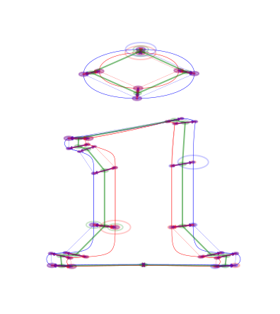

### **Introduction / Phase Introduction / Implementation Phase**

---

### **Introduction / Phase Introduction / Implementation Phase / Solutions**

*  Researched Solutions:

	*  BATRIC
		*  Graph Search Outside-In - Center Transfer - Line Matching - Barycentric Triangle Comparisson


---

### **Introduction / Phase Introduction / Implementation Phase / Solutions / BATRIC**

Needs review of current code structure and update (VRM-1011 BATRIC Documentation Update).

Location: ```lib/batric```


1.  **BATRIC Execution Sequence** Components ∞0.001 to be updated:
	1.  Initiator ```init_instances```:
		1.  Initiator Maker ```make_instances```:
			1.  Simplification Display ```fitCurve```
			1.  Main Function ```do_rad_search ```:
				1.  Point Matcher Source ```get_source_matches ```:
					1.  Get Encircled ```in_circle```
					1.  Get Circular Line Index ```get_line_inx```
					1.  Get Encircled PSCA ```get_points_around```
					1.  Rotate Points ```rotate_points```
					1.  Get Point Line ```get_point_line```
					1.  Plot Point Line ```plot_region_line```
					1.  Line Check ```do_line_check```
						1.  Create Center Transfer ```make_ct```
						1.  Get Barycentric ```barycentric```
						1.  Compare Triangles ```triangle_comparisson```
							1.  Get Target Match PSCA ```evaluate_psca```
							1.  Move Triangle Coordinates ```move_tri```
				1.  Point Matcher Target ```get_target_matches ```:


**Initiator Maker**:

We initiate the instances by providing .glif format strings with 2D vector data. Our instances are divided into Source and Target instances, the Source is considered "gnostic" and the Target "agnostic", because in the Source, having a current_point, we can define our PSCA (Pre, Search Center and Ante points), making it gnostic, in contrast for Target we cannot define those points unless we proceed with creating a line with points matched by the PSCA, making Target agnostic.

**Main Function**:

When we have the initiated graphs for each instance (Source and Target), we can obtain a lengthwise list based on the graph center to node - edge length. As we essentially overlap the instances based on the graph center, the barycentric of the graph. This way we avoid iterating points based on their index in the shape as the vectors may have differentiation in point indexing.

We find the immediate points before and after the SC (Search Center), that is the point that we are currently iterating or the most distant point from the center (Outside to Inside). We manage to have a sPSCA for the gnostic or Source side, keeping in mind the circular nature of the sPSCA as it may overlap the line start/end.

Then we attempt to gather the agnostic side points that are at a specific radius from the sPSCA (Source PSCA). If there is nothing found in that radius we assume a "ghost point" and provide the coordinates of the P or A (Pre or Ante) points as matches as we rely on a minimum number of three points so we can identify matches.

We then plot the line on the Source making sure of the appropriate circular indexing where lines should not jump across the shape, and should actually be positioned exactly on the existing lines of the glif vectors.

Proceeding to the creation of the center transfer method that looks for Target points close to the sPSCA line and Source points - according to a perpendicular to the graph center and each sPSCA point, extended infinitely line - by further creating lines from those found target points found inside a radius of the sPSCA points, and sorting based on a created triangle that includes as points ( one: the current sPSCA point, two: the target point that we matched, three: the intersection of the infinite perpendicular line and the line extended from the target matched point), calculate that triangles surface area and we have best Target matches for each of the Source P, SC and Ante points.

Moving on to triangle comparison, we can now create the barycentric of the sPSCA (sPSCA_bar), evaluate the tPSCA triangles according to our rules, and start comparing and matching them to our sPSCA by overlapping them according to barycentric and comparing angles differences, edge lengths surface areas to obtain the best matching.

**Aggregate Line**:

We now know if P, SC or A is incorrect and create a new line by combining the other lines. This means that if by increasing radius to gather agnostic points in the target that do not properly create a line, we correct this by always getting 7 points, 3 points from each side of the most favorite to the SC, we do this by using our P and A points as observers, we also know if any of the P SC or A do not exist, we will use this to filter out a perfect agnostic line before triangulation. Now by perfecting triangulation we hope to be able to get 100% best matches in any shape that looks identical.


#### Solutions offered

**Not Matching Glyph Order:**

One of the solutions helps match the contour order with certainty. Having two contours of unmatched starting points, but even contour lengths, we can produce an appropriate match by either reproducing the contour array according to the match or shifting the contour array according to the match.

We can see the red and blue outline circles that denote the start and end points for each instance don't match. The script solves the start points and equally denotes them with green outline circles.

This also would be the case even if we would have in between points that don't match any other point in a secondary instance, those points would be bypassed and we would still have a proper match. Only in extreme scenarios the matching fails.

---



image: #034, 0.001, svg, letter "i" with same number of points but not same start point solved. Letter part has unmatched initial start points, the accent has matched initial.

---


image: #035, 0.001, svg, letter "eight" with same number of points but not same start point solved. External contour starts from the top and the opposite instance starts from the bottom. The solution repositions it to the top. The internal contours have the same start points.

---


image: #036, 0.001, svg, letter "r" with uneven number of points but same start point solved.

---

<small>

**SCHEDULE:** ```VRM-1010```

**SCHEDULE:** ```VRM-1010-0001```

**SCHEDULE:** ```VRM-1011```

</small>

---

### **Introduction / Phase Introduction / Implementation Phase / Solutions / Revisional**

---

### **Introduction / Phase Introduction / Implementation Phase / Solutions / Revisional / Parts**

### Parts

* V(Instance)
	* Vertices of instace A
* E(Instance)
	* Edges of instace A
* B(Instance)
	* Barycentric Edges of instace A, Function B needs the rest of the instances for δ. Starts count from zero as Barycentric point.

---

### **Introduction / Phase Introduction / Implementation Phase / Solutions / Revisional / Mechanisms**

#### Center Transfer Tree (κ, kappa):

Works only for **B** Barycentric Edges, ```κB(Vertice Index, Other Instance)```. Returns Center Transfer Tree of the provided instance against the other instance.

#### Tree (δ, delta):

On the Current Vertice (cV), we get the Barycentric Vertice it corresponds, we create a perpendicular infinite line (PIL) on that B. Then in the other instances we look for Vertices that are close to that line and create further perpendicular lines extending from those points to meet the PIL. 

The intersection point from the other Instances Vertice (oV) to the Current Vertice PIL is called P. The cV, P and oV create a triangle ```Δ = (cV,P,oV)``` and an area of the triangle ```A = (Δ)```, we store this for each point for each instance as AreaTriangle (ΔA) that includes ```ΔA = [ΔA, A(Δ)]```. **The ΔA best match is one from ΔA with the smallest Area**.

```δB(Vertice Index, Other Instance) = sort([ΔA(v23)[A],ΔA(v24)[A],ΔA(v25)[A]]```

---

### **Introduction / Phase Introduction / Implementation Phase / Solutions / Revisional / Complete Logic**

```
i1 = ([x,y], ...)

Instances = (i1, i2, i3)

i1 = (V(i1), E(i1), B(i1, Instances))

for instance i1

	V(i1) = {v1, v2, ..., vn }
	E(i1) = {e1, e2, ..., en }
	B(i1, Instances) = {b0, b1, ..., bn}

provided B(i1) and V(i1) of instance.

	b0 = barycentric of Instance only no kappa.
	b1 = { κB(v1,i2), κB(v1,i3) }
	κB(v1,i2) = { δB(v1,i2),δB(v2,i2) }

```

---

### **Introduction / Phase Introduction / Implementation Phase / Solutions / Revisional / Functions**

#### Logic Tree

* ContourHolder: Takes .glif and imports the necessary data. Minor contour fixing like orientation.
* GraphConstructor: Constructs a graph with the data necessary for the Evaluation Algorithms
* GraphEvaluator: Evaluates the graph according to the Evaluation Algorithms
* InstanceMatcher: Matches the Instance Points with the data collected from the Evaluator
	* PointNormalizer: Normalizes the path types across all Instances


#### Preparatory Functions

These functions are used to create the numbers we need to run further comparison logic. We create the graphs and Center Transfer Trees for each Instance.

* Prep Functions:
	* make\_graphs
		* make\_v
		* make\_e
		* make\_b
	* make\_ctt
		* make\_delta

---

### **Introduction / Phase Introduction / Implementation Phase / Solutions / Revisional / Functions / Function Review**

#### Function make_graphs(Instances)

Creates Instance Graphs ```V,E,B(without κB)``` for provided Instances.

#### Permute CTT make_ctt(Instances)

Populates ```B``` in each Instance with ```κB``` against other Instances, by building ```δB``` for each Instance Vertice leveraging Barycentric Edges.

---