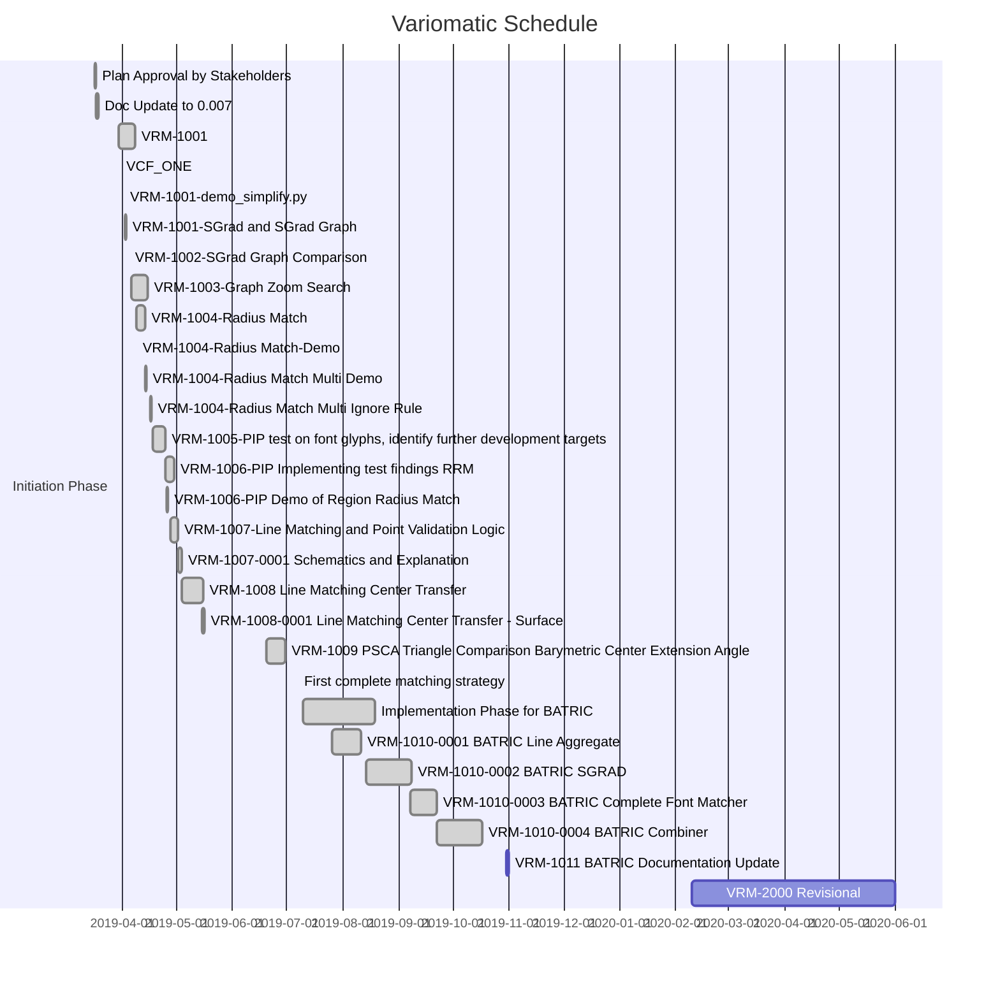

Overview:

**2019-10-29 / Publishing initial Variomatic (BATRIC) on GitHub**




Schedule:

*  Current:
    *  **VRM-2000** Revisional / Andreas Kalpakidis & Madina Akhmatova

*  Completed:
    *  ~~**Assumptions Research** / 2019-March-07 until the end of 2019-March-21~~:
        *  During the assumptions research we have identified a possible solution, the Point Importance Product.
    *  ~~**Docs LayerA Update** / 2019-March-22~~:
        *  We have updated the documentation to match that of our initial findings a little early - at March 16
    *  ~~**Plan Approval by Stakeholders** / 2019-March-17~~:
        *  Plan has been approved and a total has been accepted.
    *  ~~**Doc Update to 0.007** / 2019-March-18~~:
        *  The documentation has been updated to reflect current status.
    *   **VRM-1001**:
        *  ~~One simplification solution implemented. ```demo_simplify.py``` 04/02/2019 5h~~
        *  ~~SGrad and SGrad Graph (topo). 04/03/2019 7h~~
    *   **VRM-1004**:
        *  ~~Radius Match, with demo point match. 2019-04-09, 4h~~
        *  ~~Radius Match Multi, with demo point match. 2019-04-14, 8h~~
        *  ~~Radius Match Multi, with ignore rule. 2019-04-17, 8h~~
    *   **VRM-1005**:
        *  ~~PIP Testing different contours. 2019-04-20, 4h~~
    *   **VRM-1006**:
        *  ~~Demo of Region Radius Match. 2019-04-26, 8h~~
    *   **VRM-1007**:
        *  ~~VRM-1007-0001 Schematics and Explanation~~
    *  **VRM-1000** Point Importance Plan Scheduling / Andreas Kalpakidis & Madina Akhmatova
        *  **VRM-1006** Implementing Regional Radius Match (RRM).

Task Codes:

*  VRM-1001 Simplification
*  VRM-1002 SGrad
*  VRM-1003 Graph Zoom Search
*  VRM-1004 Radius Match
*  VRM-1005 PIP Testing
*  VRM-1006 Regional Radius Match
*  VRM-1007 Line Matching and Point Validation
*  VRM-1008 Line Matching Center Transfer
    *  VRM-1008-0001 Surface
*  VRM-1009 Barymetric Triangle Matching by Extension angle
*  VRM-1010 BATRIC
*  VRM-1010-0001 Line Aggregate - Perfect Line
*  VRM-1010 BATRIC
    *  VRM-1010-0001 BATRIC Line Aggregate
    *  VRM-1010-0002 BATRIC SGRAD
    *  VRM-1010-0003 BATRIC Complete Font Matcher
    *  VRM-1010-0004 BATRIC Combiner
*  VRM-1011 BATRIC Documentation Update
*  VRM-2000 Revisional

